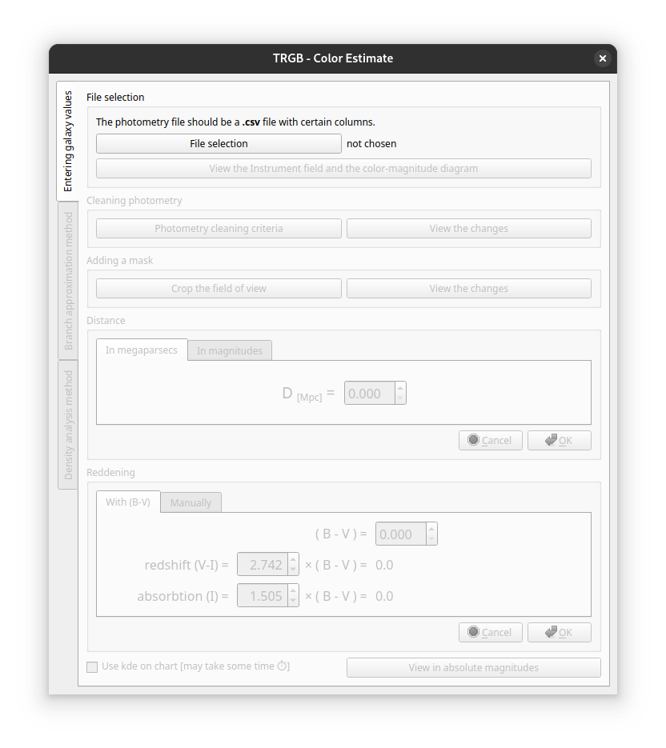
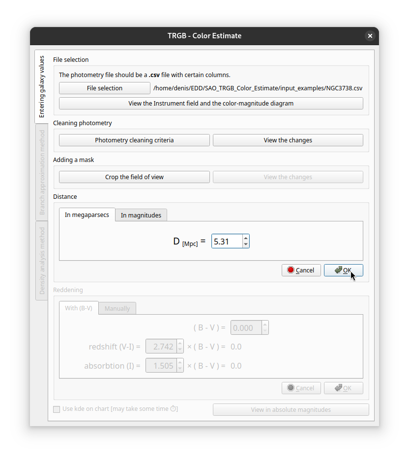
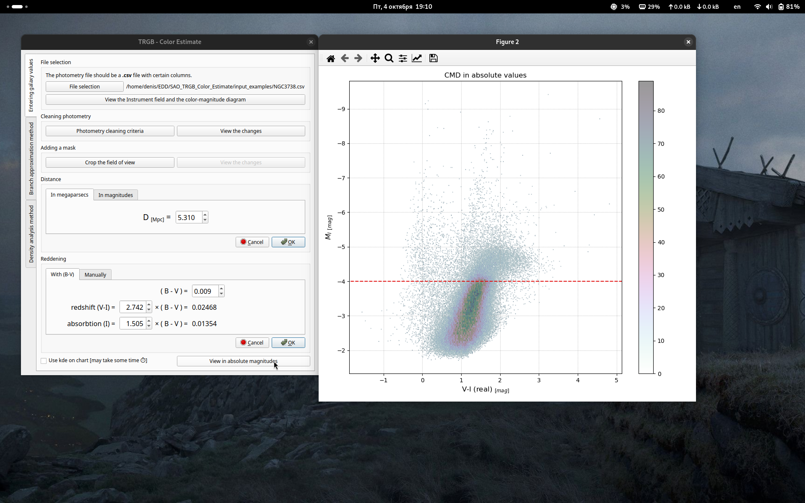
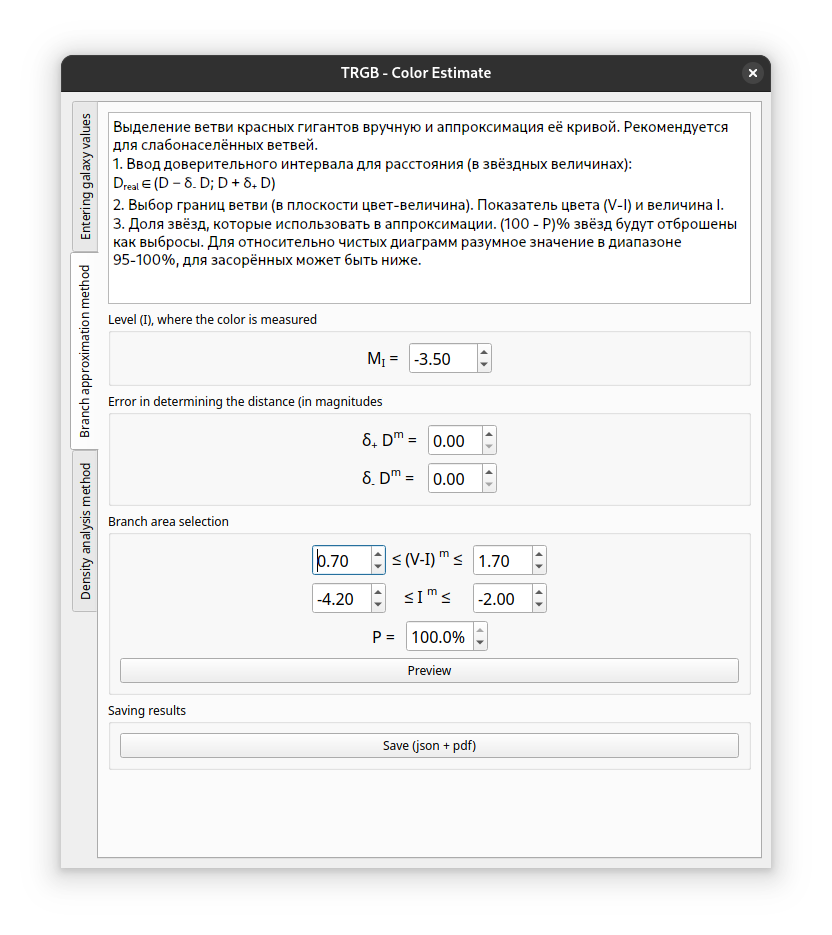
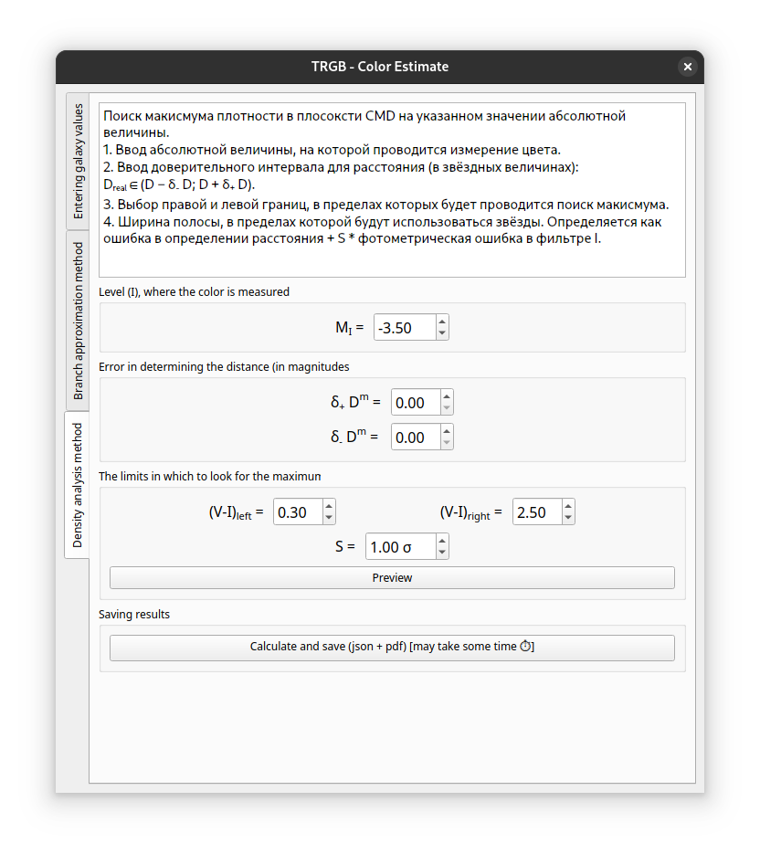

# TRGB - Color Estimation

### Install
To create a working environment in Conda, run:
```
conda env create -f environment.yml
```
This will create an environment called `trgb_gui`, which will contain all the necessary Python packages. Alternatively, you can install them manually: 
- python > 3.9
- pyqt
- fpdf2
- matplotlib
- numpy
- pandas
- pillow
- scipy
- seaborn
- jupyterlab

Note: its `fpdf2`, not `fpdf`!

### Run
If you installed the environment using `environment.yml` activate it and run: 
```
conda activate trgb_gui
python run.py
```

# Usage
### File selection and basic data entry
This is what you should see:


1. Select file `.csv` file with photometric data. Each row should represent a possible star. Mandatory columns: `x`, `y` (coordinates in the instrument's field of view), `mag_v`, `err_v`, `mag_i`, `err_i` (apparent magnitude and measurement error in filters I and V, respectively). 

    Columns `type`, `snr_x` (i.e. `snr_v` or `snr_i`), `sharp_x`, `round_x`, `crowd_x`, `flag_x`, if present, can be used to clean data in the next step.

2. Clean the photometry data. Select criteria to use, change them if necessary.

3. Crop the field of view if necessary. You can skip this step entirely.



4. Enter distance (in MPc or in Mag). Click `Ok`.

5. Enter redshift (V-I) and absorbtion in filter I. Click `Ok` or `Cancel` to reset.

6. View the cleaned instrument field and color-magnitude diagram in absolute magnitudes. There will be density histogram over the scatterplot, you can change it to kernel-density plot (kde) if you need. Using kde usually takes some time.



### Branch approximation
TBA



### Density analythis
TBA



### Input format

TBA