# TRGB - Color Estimation

This small program was written during the processing of the EDD catalog to measure the color index of the red giant branch. Now I'm making it freely available. 

This Python program allows you to clean the photometry file, crop the field of the instrument (for example, by selecting the outer regions of the galaxy in field), build a color-magnitude diagram and measure the color index at any level ($M_I$) in two ways: by searching for the maximum density or approximating the branch with a parabola. For convenience, a graphical interface written in QT5 is used. 


When using (including modification), I humbly ask you to quote the work "TBA".

# Install
To create a working environment in Conda, run:
```
conda env create -f environment.yml
```
This will create an environment called `trgb_gui`, which will contain all the necessary Python packages. Alternatively, you can install them manually: 
```
- python > 3.9
- pyqt
- fpdf2
- matplotlib
- numpy
- pandas
- pillow
- scipy
- seaborn
- jupyterlab
```

Note: its `fpdf2`, not `fpdf`!

### Run
If you installed the environment using `environment.yml` activate it and run the program: 
```
conda activate trgb_gui
python run.py
```

# Usage
### File selection and basic data entry
Run the program. This is what you should see:

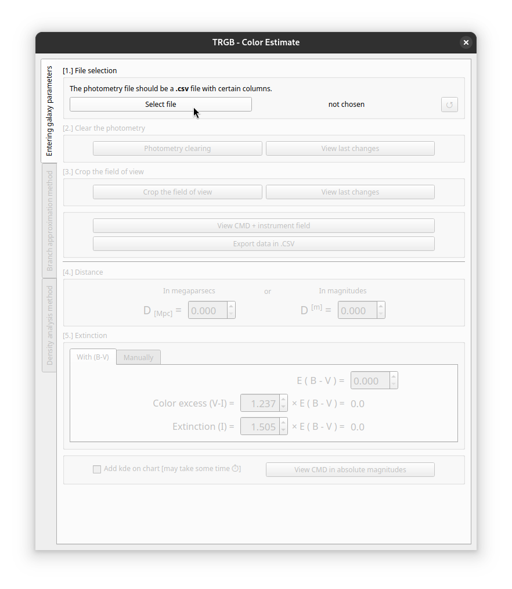

1. Select file `.csv` file with photometric data. Each row should represent a possible star. Mandatory columns: `x`, `y` (coordinates in the instrument's field of view), `mag_v`, `err_v`, `mag_i`, `err_i` (apparent magnitude and measurement error in filters I and V, respectively). 

    Columns `type`, `snr_x` (i.e. `snr_v` or `snr_i`), `sharp_x`, `round_x`, `crowd_x`, `flag_x`, if present, can be used to clean data in the next step.

    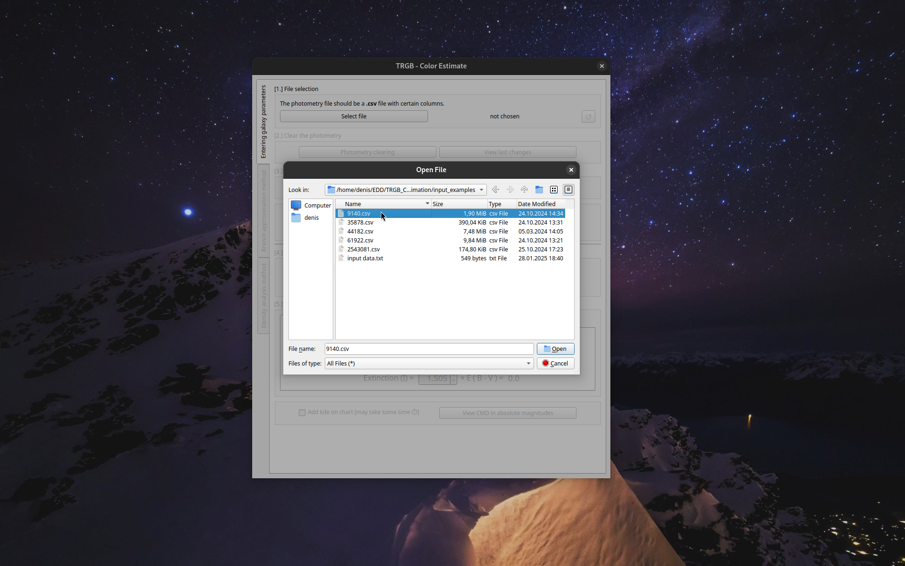

2. Clean the photometry data. Select criteria to use, change them if necessary. In this example, I got rid of the bottom of the CMD by raising the Signal/Noise threshold.

    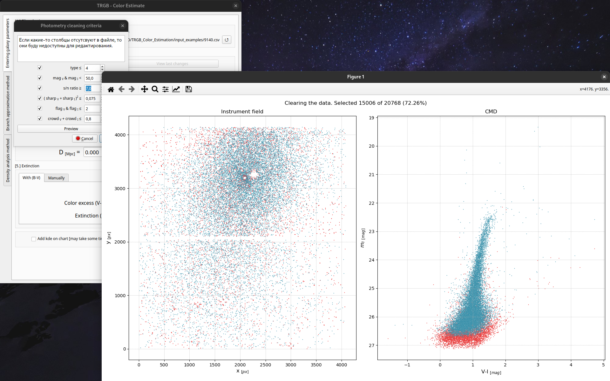

3. Crop the field of view if necessary. In this example, I have cut off the areas of the instrument's field most dense with stars, and thus selected only the outer regions of the galaxy. You can also select a rectangular area in the field by entering the coordinates manually.

    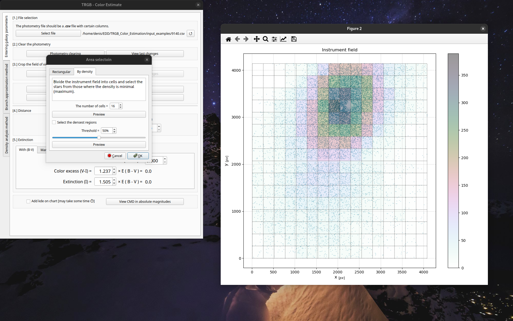

    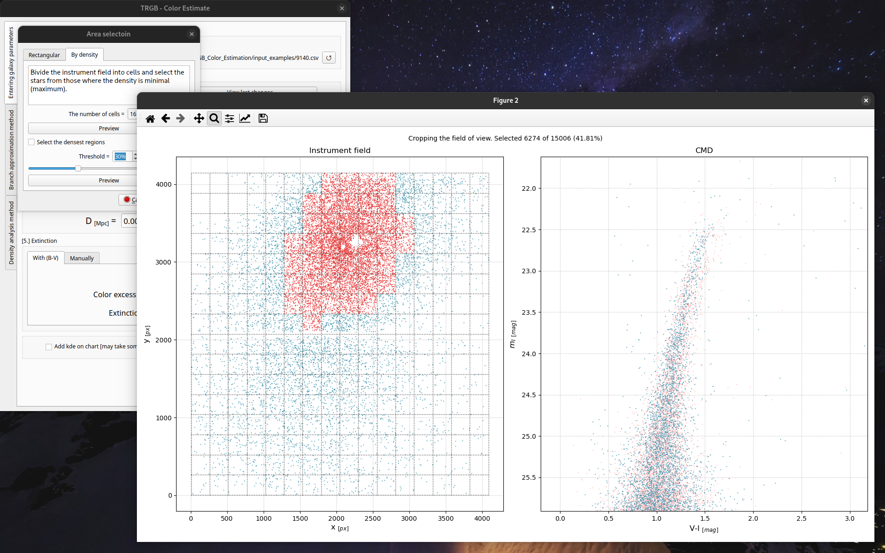

4. Enter distance (in MPc or in Mag).

    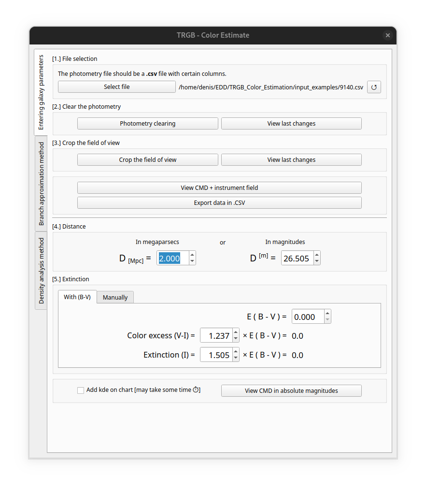

5. Enter extinction (V-I) and absorbtion in filter I.

    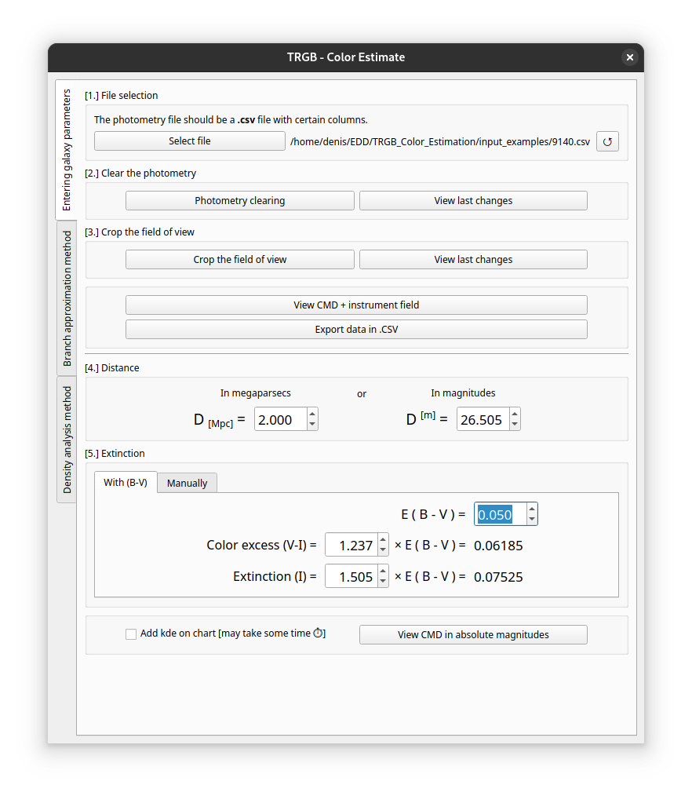

6. View the cleaned instrument field and color-magnitude diagram in absolute magnitudes. There will be density histogram over the scatterplot, you can change it to kernel-density plot (kde) if you need. Using kde usually takes some time.

    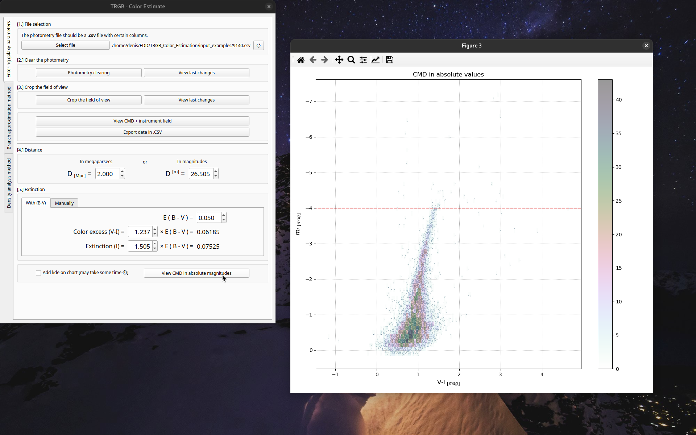
    
    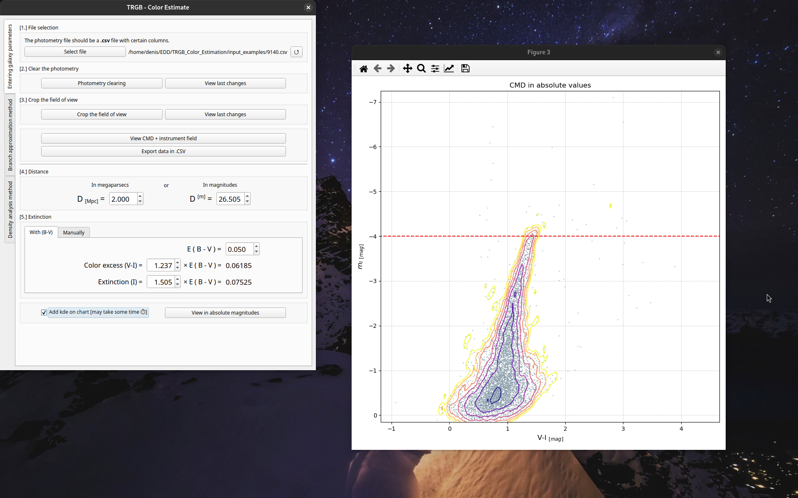

The program provides the ability to measure color index using two methods described in the article (ref. TBA).

### Branch approximation
This method allows one to approximate the branch of red giants using a parabola. A peculiarity of this method is that one must manually specify the boundaries of the region in color index (V-I) - brightness (I) coordinates where the branch is located.

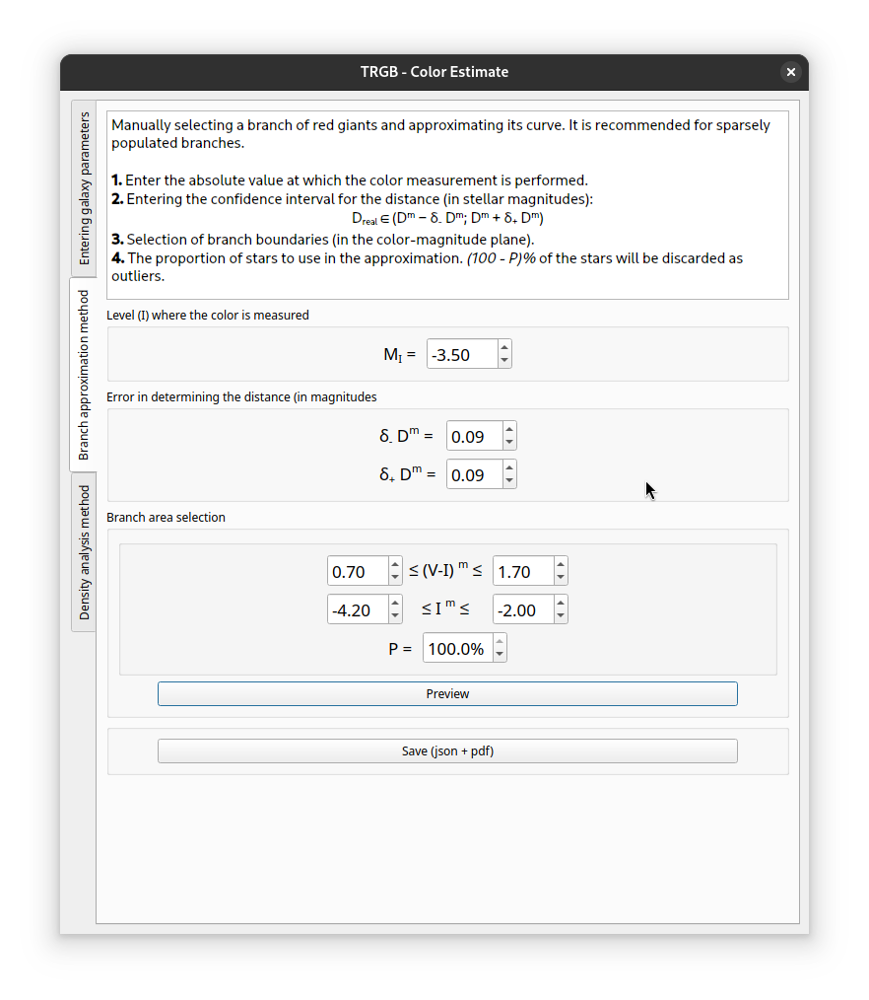

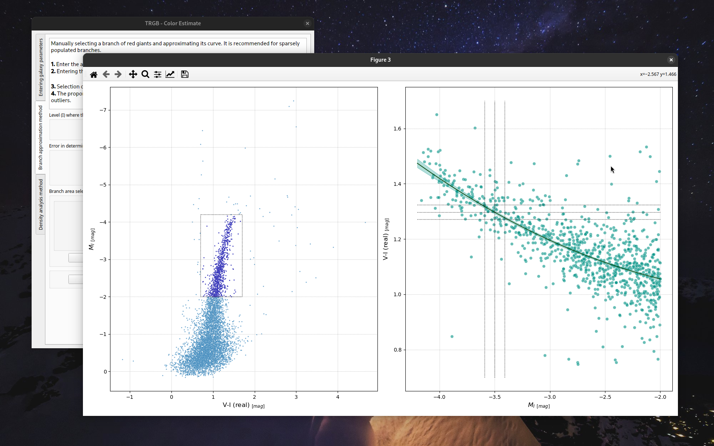

### Density analythis
This method allows one to measure the color index using the density profile of the stars at the specified M_I level. The confidence interval estimate will be obtained using the Monte Carlo method.

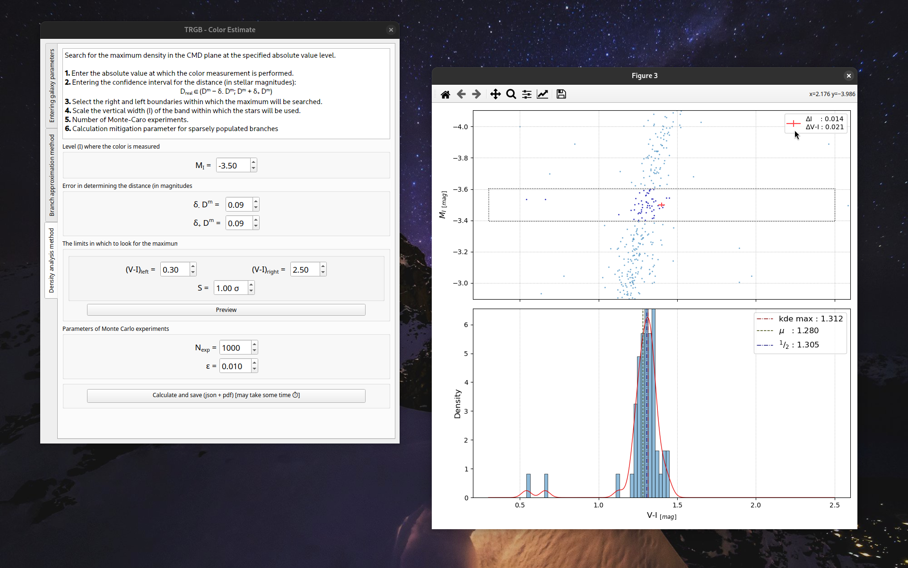

### Saving results
The processing result will be two files: a json file with parameters and numerical estimates, and a pdf file with a visualization of intermediate graphs.

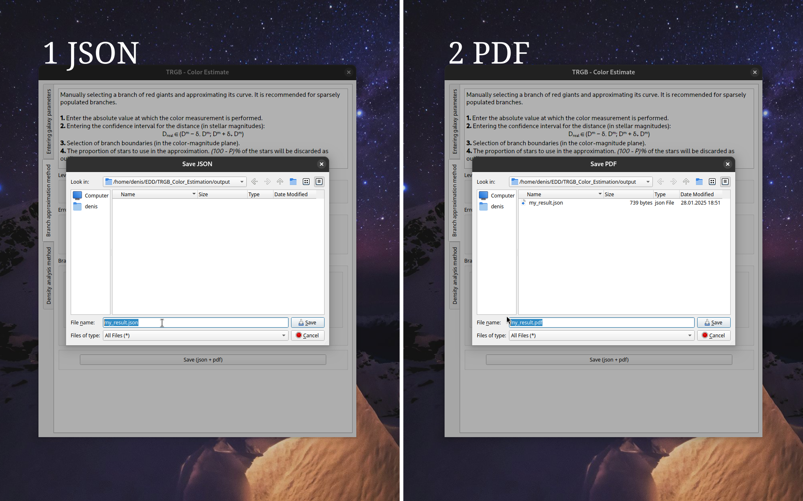

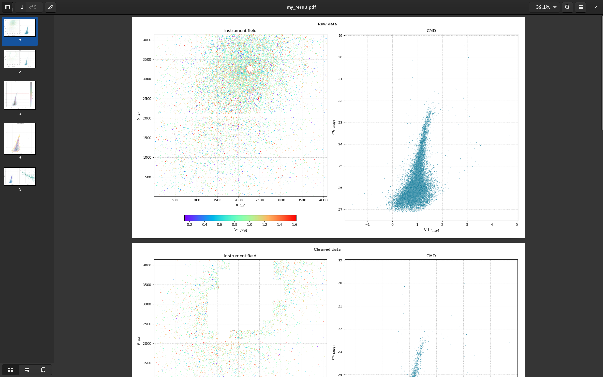

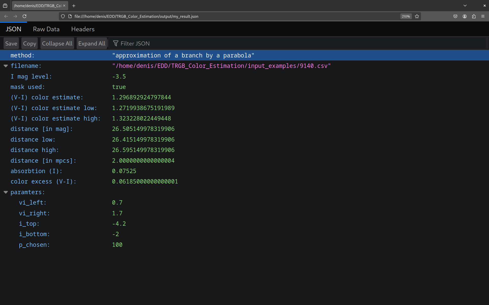
